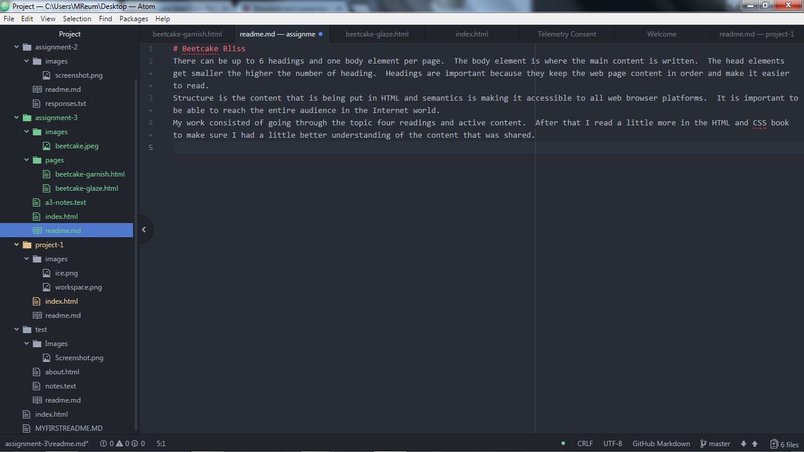

# Beetcake Bliss
There can be up to 6 headings and one body element per page.  The body element is where the main content is written.  The head elements get smaller the higher the number of heading.  Headings are important because they keep the web page content in order and make it easier to read.
Structure is the content that is being put in HTML and semantics is making it accessible to all web browser platforms.  It is important to be able to reach the entire audience in the Internet world.
My work consisted of going through the topic four readings and active content.  After that I read a little more in the HTML and CSS book to make sure I had a little better understanding of the content that was shared.

