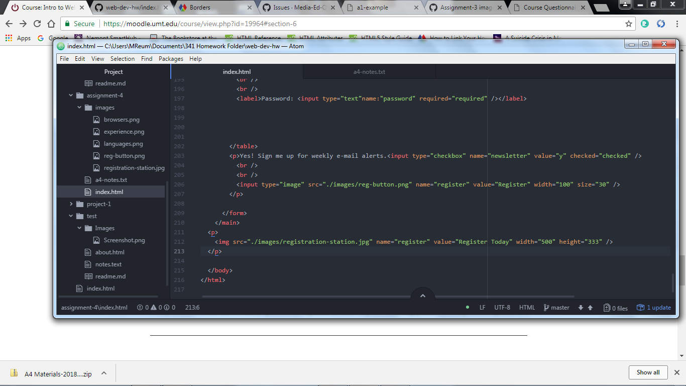

# Assignment-4
## Alt Text
Alt text is placed within the image description in case the image cannot be viewed it allows the reader to read the text pertaining to the picture.
## Forms
I am not aware what this question is referring to.
## Summary
This assignment was very frustrating.  It was, however, rewarding to see the finished product.  This week started off with Module 5 readings.  It took quite awhile to navigate through this section and I revisited this module frequently.
## Screenshot

