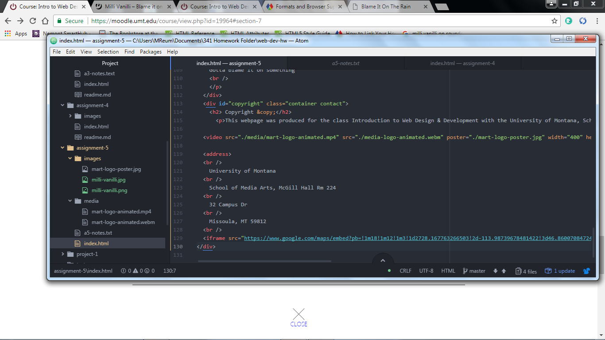

# Assignment-5
## Difference between Id, Class, Division, and Span:
- ID-  Uniquely identifies the particular element.

- Class-  Groups similar types of elements together by using the same unique value.

- Division- Allows the deveeloper to group certain elements together.  It increases structural clarity and increases readability.

- Span-  Is used to identify such things as text that need to appear in a unique manner.
### Third Party Hosting over Self-Hosted media
The advantage of using a hosted media provider is that you can upload a high-quality version of your media and these sites will handle compatibility, encoding, and the other details necessary for the media to play on a variety of browsers.

#### Work Cycle for this assignment:
I started this week off by reviewing and reading the assigned readings.  It was a very difficult assignment and as you can see I couldn't figure out how to center my image and I couldn't get the video poster to load correctly.  However, I feel as though I am gaining valuable information.

