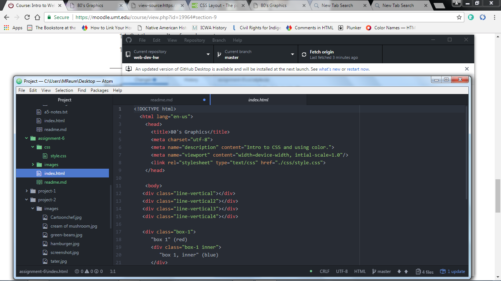

# Assignment 6
This assignment was difficult and I did not present the best page.  I have a difficult time envisioning how something should look.  My artistic side is definitely not up to par.

I used teal, pink, yellow and purple as my colors.  I remember pink being a very popular color in the 80's.

This assignment was very difficult for me to conceptualize.  I have stated in the past that I am not a media arts student and took this as an elective.  With that being said I read all of the required readings and I also used W3 Schools for assistance.  I am definitely learning but I really struggle with this course.

