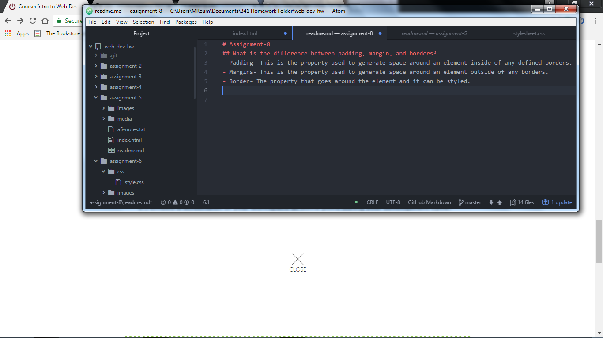

# Assignment-8
## What is the difference between padding, margin, and borders?
- Padding- This is the property used to generate space around an element inside of any defined borders.
- Margins- This is the property used to generate space around an element outside of any borders.
- Border- The property that goes around the element and it can be styled.
### What was the most difficult task for this Assignment
I really struggle with fonts and also on this assignment I struggled with layout. As you can see I still don't have layout exact but I am getting closer.  I can say that this is much better than my previous attempt.
#### Work Cycle
This assignment took a very long time.  I started by reading through the required text and then I also used W3 Schools alot.  I watched videos on youtube to gain a better understanding of css as well.  It took a long time to figure out how to align everything and as my assignment shows, it was not exact but I feel as though I made great leaps with this assignment
 
