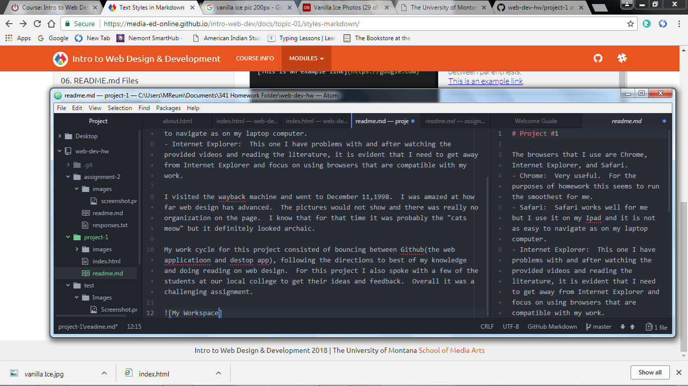

# Project #1

The browsers that I use are Chrome, Internet Explorer, and Safari.
- Chrome:  Very useful.  For the purposes of homework this seems to run the smoothest for me.
- Safari:  Safari works well for me but I use it on my Ipad and it is not as easy to navigate as on my laptop computer.
- Internet Explorer:  This one I have problems with and after watching the provided videos and reading the literature, it is evident that I need to get away from Internet Explorer and focus on using browsers that are compatible with my work.

I visited the wayback machine and went to December 11,1998.  I was amazed at how far web design has advanced.  The pictures would not show and there was really no organization on the page.  I know that for that time it was probably the "cats meow" but it definitely looked archaic.

My work cycle for this project consisted of bouncing between Github(the web applicatioon and destop app), following the directions to best of my knowledge and doing reading on web design.  For this project I also spoke with a few of the students at our local college to get their ideas and feedback.  Overall it was a challenging assignment.

