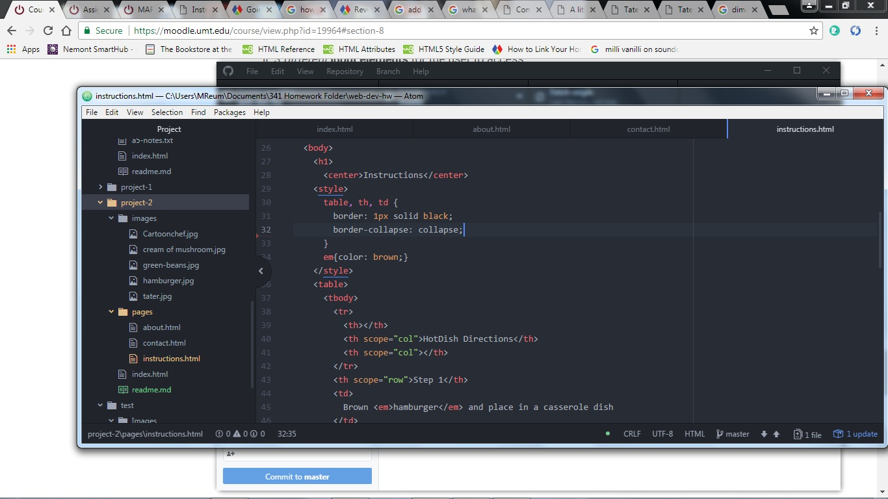

# Project-2(The Abyss)

## HTML Learning curve
HTML has presented itself as very friendly user but I am still finding it difficult
to remember everything that is involved with it.  Styling is definitely difficult for me
to figure out.  I used W3 Schools a lot in this lesson.

### CSS Beginnings
I am not familiar with CSS so I am not sure what to expect.  I have said it many times
and will say it again that this is the toughest, but most rewarding, class that I have taken
in my college career.  I look forward to the challenge

#### Work cycle for this week
I can say that I spent a considerable amount of time on this project(appr. 11 hours).  It is
getting easier and more understandable to write code but I still struggle with img src and how to
properly code them to get my images to show up.  I used W3 Schools for many of my questions.  I also
referred to previous assignments.  I also found the examples to be very helpful for ideas on how to structure
my page as I am not artistic and have trouble envisioning things.

